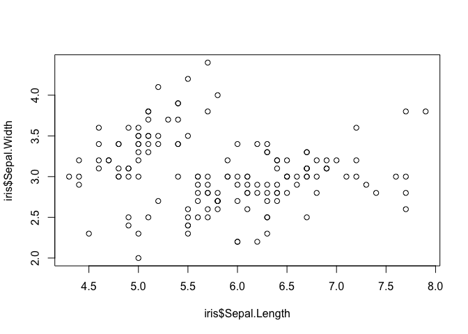

Test Email Doc
================

## Quarto

Quarto enables you to weave together content and executable code into a
finished document. To learn more about Quarto see <https://quarto.org>.

## Running Code

When you click the **Render** button a document will be generated that
includes both content and the output of embedded code. You can embed
code like this:

``` r
data(iris)
plot(iris$Sepal.Length, iris$Sepal.Width)
```

<!-- -->
